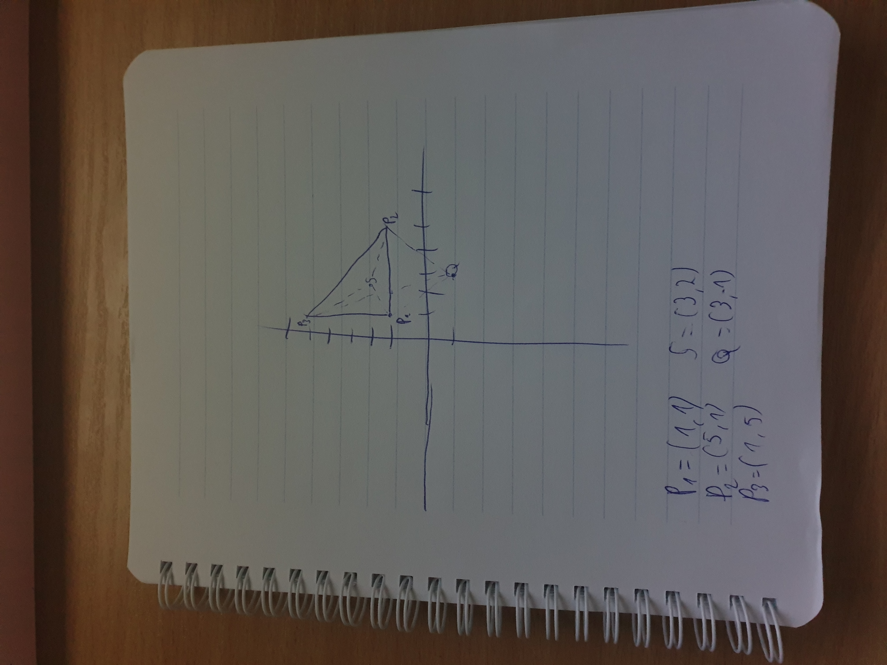

# point-in-triangle

This demonstrates how to determine whether an arbitrary point lays inside a triangle, given only the 3 points of the triangle.

It works by checking if the area of the "main" triangle is equal to the sum of all the possible triangles formed, using the point, as shown below.

Given

```bash
P_1 = (1, 1) # First point of triangle
P_2 = (5, 1) # Second point of triangle
P_3 = (1, 5) # Third point of triangle
S = (3, 2) # Example of point inside triangle
Q = (3, -1) # Example of point outside triangle
```



We can compute the area of our main triangle `△ P_1 P_2 P_3`. This can be achieved using some basic linear algebra. As demonstrated in [1] and proven in [2], we can compute the area of it, using the Determinant of the following matrix:


...where `X_1, Y_1` and so on, are the coordinates of each point in the triangle.

We can then apply the same algorithm to each subsequent triangles:

```bash
# Combinations of triangles, given S
△ P_1 P_2 S
△ P_1 S P_3
△ S P_2 P_3
# Combinations of triangles, given Q
△ P_1 P_2 Q
△ P_1 Q P_3
△ Q P_2 P_3
```

We can now finally check if the point resides inside or outside the triangle. By getting the absolute values of the triangle areas we are interested in (for example, only those, formed given `S`) and ensuring that their sum is equal to the area of our main triangle `△ P_1 P_2 P_3` we will know whether the point is inside or outside.

1. <https://people.richland.edu/james/lecture/m116/matrices/applications.html>

2. <https://people.richland.edu/james/lecture/m116/matrices/area.html>
